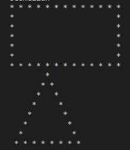
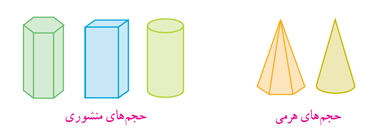

<center>
<h1>
In The Name Of ALLAH
</h1>
<h2>
Advanced Programming - Homework 4
</h2>
<h2>
Dr.Amir Jahanshahi
</h2>
<h3>
Deadline: Friday, 24 Ordibehesht - 23:00
</center>


# Introduction
In this homework. You’ll work with some geometric shapes in a polymorphic way!! You have to implement some abstract classes and drive some other classes from them. Let’s see! 😊

# 2DShape Class
This class is an abstract class consisting these methods and member variables:

```c++
class _2Dshape
{
public:
    _2Dshape(const char* name, size_t z);
    virtual double perimeter() = 0;
    virtual double area() = 0;
    virtual void disp() = 0;
    const char* getName();
    
private:    
    const char* name; 
    size_t noOfSides;
};
```

Functions functionality is clear from their names. Pure virtual functions must be override in derived classes. Three classes must be derived from 2DShape. Square, Rectangle and Triangle. 
Header file of the derived classes is given to you. Name and numberOfSides for each derived class is like this: 
Square: name=”square” ,  noOfSides=4
We assume that Triangle is isosceles (“motasavi alsaghein”). So the constructor will get to parameters, base and side.
Disp function should preform like this. Here we called disp on Rectangle and Triangle.



After implementing these four classes, we will go to 3DShape class.

#  3DShape Class

In 3DShape class we have the following methods and member variables:

```c++
class _3Dshape
{
public:
    _3Dshape(const char* type, double h, _2Dshape* base);
    virtual double volume() = 0;
    virtual double area() = 0;
    
protected:
    _2Dshape* base;
    double height;
    const char* type;
};
```

Function volume calculates the volume of the 3Dshape. Area is the side area of the shape (including base area.). height is “ertefa” and base is “ghaede”. Base is a pointer to 2DShape, so it can carry a Square, Rectangle or Triangle. Type is “Pyramid” or “Prism” based on the derived class.



Class Pyramid and Prism will inherit from 3DShape. The header files of these classes is also given.

For Prism class you should also implement operator<<. so by writing the following code, you must get this output: “base of prism is square and its height is 7.”

```c++
Square s{3};
Prism p{7, &s};
std::cout << p;
```

There is a pharaoh buried in Pyramid. In pyramid constructor, there is a size_t input. If its 1, “Tutankhamun” is the hidden pharaoh. If its 2, “Ramesses” is the hidden pharaoh and If its 3, “ Cleopatra” is the hidden pharaoh. 

As you can see, pharaoh is a dynamic member variable in the class, so you must implement all the necessary functions such as destructor, copy constructor and … . and also, you should implement move constructor for the sake of move semantics. To clarify that the right constructor is used, please display a massage showing which constructor is being used.

Finally implement operator<< for Pyramid class with following functionality:

```c++
Square s{3};
Pyramid p{3, &s, 2};
std::cout << p;
//  Output: “Pharaoh Ramesses is buried in this pyramid!”
```

**Note**: You are not allowed to add any function to the classes (except Pyramid class for sake of dynamic member variable). It’s possible to add some keywords if necessary. 

# main File
You must not alter the **main.cpp** file at all. Good luck!
